# 师陶学程 · 使用文档

> 华南师范大学学生的课表 + 教务助手  
> 适用版本：**v1.7.1**

---

## 📌 读前必看

**请先花两分钟看完这一节，再往下看。**

### 这个项目是怎么来的

师陶学程**不是从零写的**，它基于一个优秀的开源课表项目  
**[拾光课表 (shiguangschedule)](https://github.com/XingHeYuZhuan/shiguangschedule)** 做二次开发，  
原作者是 **XingHeYuZhuan（星河欲转）**。课表的核心架构、界面框架、小组件等等都来自那个项目，  
我只是在上面加了**华师专属的教务对接**（课表同步、成绩、考试、培养计划、选课）。

没有原作者打好的底座，这个 App 不会存在。请把这份感谢记在心里。

### 关于我的能力

**我是一个华师的普通学生，不是专业开发者，个人能力非常有限。**

- 这个 App 里**一定还有 bug**，也一定有你遇到但我没想到的场景。
- 教务系统的接口说变就变，变了之后我需要时间去适配，**可能有一段时间用不了**。
- 有些地方可能做得不够好、不够快、不够漂亮 —— 这是能力问题，不是态度问题。

### 我做这个的唯一目的

**让华师同学少在教务系统里折腾。**

教务系统网页在手机上有多难用，用过的人都懂：界面老、要反复登录、成绩要一个个点。  
如果这个 App 能帮你每天少花两分钟，那它就值了。**它免费、无广告、不收集你的任何个人信息。**

### 遇到问题请一定反馈

**这一条最重要。** 你遇到问题时：

- ❌ 不要默默卸载 —— 那样后面几百个同学还会踩同一个坑；
- ✅ 请花一分钟告诉我，一条反馈可能就帮很多人省了事。

反馈渠道（任选）：

| 渠道               | 位置                                                 |
| ---------------- | -------------------------------------------------- |
| **App 内反馈**      | 我的 → 更多 → **反馈与建议**                                |
| **GitHub Issue** | <https://github.com/TangeTiv/SCNU-Schedule/issues> |
| **QQ 频道**        | `pd87880575`                                       |

反馈时**尽量说清楚**：你点了什么、期望是什么、实际是什么、有没有报错截图。  
说得越具体，我修得越快。

### 也请理性看待

- 这是**个人维护的免费项目**，我没有义务也没有能力做到 100% 完美；
- 我会尽力修，但**不能保证及时**（我也有课要上、有试要考）；
- 如果某个功能暂时用不了，请先看看 [常见问题](#八常见问题) 里有没有答案。

**谢谢你的包容，也谢谢你的反馈。**

---

## 目录

1. [这是什么](#一这是什么)
2. [安装](#二安装)
3. [第一次使用（三步搞定）](#三第一次使用三步搞定)
4. [课表](#四课表)
5. [校园（教务功能）](#五校园教务功能)
6. [我的（设置）](#六我的设置)
7. [桌面小组件](#七桌面小组件)
8. [常见问题](#八常见问题)
9. [反馈与建议](#九反馈与建议)

---

## 一、这是什么

一句话：**把华师教务系统里的课表、成绩、考试、培养计划搬到手机上，做得比教务系统好看好用。**

### 不需要登录就能用的

| 功能          | 说明               |
| ----------- | ---------------- |
| 周课表 / 今日课表  | 看课、看教室、看老师       |
| 手动添加 / 编辑课程 | 不想同步教务也能自己录      |
| 课表导入 / 导出   | JSON 备份、导出到系统日历  |
| 上课提醒        | 提前提醒，可自动开勿扰      |
| 桌面小组件       | 不用打开 App 就能看下一节课 |
| 深色模式 / 主题色  | 看着舒服             |

### 需要登录教务才能用的

| 功能   | 说明                  |
| ---- | ------------------- |
| 教务同步 | 一键把课表、成绩、考试、培养计划拉下来 |
| 成绩查询 | 历年成绩 + 平均绩点         |
| 考试安排 | 考场、座位号、倒计时          |
| 学业情况 | 培养计划树 + 学分完成度       |
| 自主选课 | 在手机上选课 / 退选         |

> **登录只需一次**。v1.7.0 起，学号密码只在【我的 → 账号】里输一次，  
> 之后进这些功能都不用再输（用指纹或人脸解锁）。

---

## 二、安装

### 从哪里下载

**推荐从 Gitee 下载**（更新也是从这里走的）：

👉 <https://gitee.com/TangeTiw/scnu-schedule/releases>

在最新版本的「附件」里下载 `SCNU-Schedule.apk`。

> GitHub 也有镜像：<https://github.com/TangeTiv/SCNU-Schedule/releases>  
> 但 App 的自动更新只读 Gitee，所以**优先用 Gitee**。

### 选哪个包？

目前发布的是 **arm64-v8a** 版本，覆盖**绝大多数 2018 年以后**的安卓手机。  
如果你装上去提示「应用未安装 / 不兼容」，说明你的手机是 32 位（armeabi-v7a）或 x86 架构，  
请到反馈渠道告诉我，我再补对应的包。

### 系统要求

**Android 8.0 及以上**。

### 安装时会提示「未知来源」

因为不是从应用商店装的，系统会拦一下。按提示允许「安装未知应用」即可，  
装完可以再关掉这个权限。

### 怎么更新

两种方式，**数据都不会丢**：

1. **App 内更新（推荐）**：我的 → 更多 → **检查软件更新（首次软件内更新会报“危险”，无视风险即可）**
2. **手动更新**：直接下载新版本的 APK 覆盖安装

---

## 三、第一次使用（三步搞定）

**全新安装后第一次打开，会看到这个引导弹窗**（升级安装不会看到）：

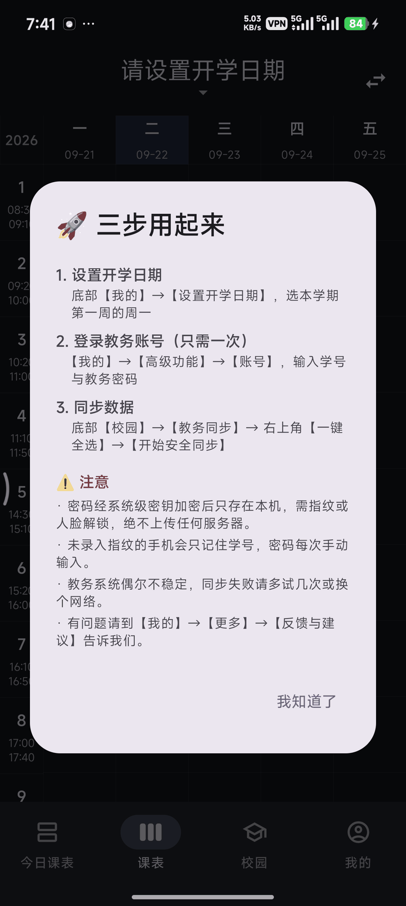

按上面的三步做一遍就行。下面逐步说明。

### 第 0 步：设置开学日期 ⚠️ 别跳过

打开 App → 底部 **【我的】** → **【设置开学日期】**，选择本学期第一周的**周一**。

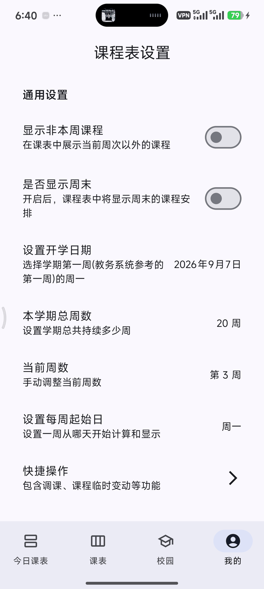

> **为什么重要**：App 靠这个日期算「现在是第几周」。  
> 填错了，课表上的周次就全错了（比如单双周课程会显示错）。  
> 教务系统的第一周以它自己的校历为准，**照着教务系统填**。

顺便可以设置：**本学期总周数**、**每周起始日**（周一还是周日）。

### 第 1 步：登录教务账号（只需一次）

**【我的】→【高级功能】→【账号】**

第一次打开时这个页面是**空的**，学号密码都要自己填：

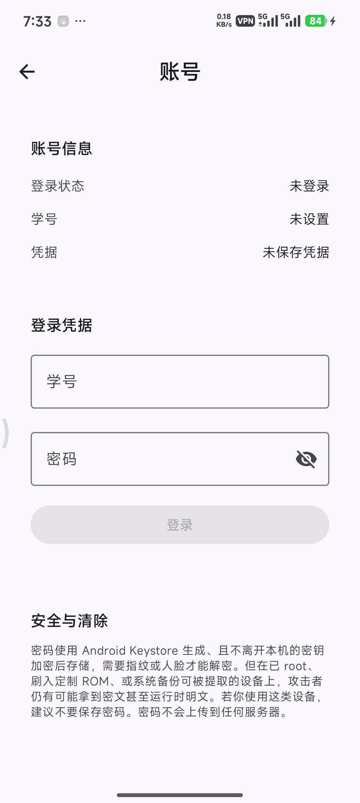

填好**学号**和**教务系统密码**，点【登录】。

登录成功后会弹一次**指纹或人脸验证**，验证通过就把密码**加密保存在本机**了：

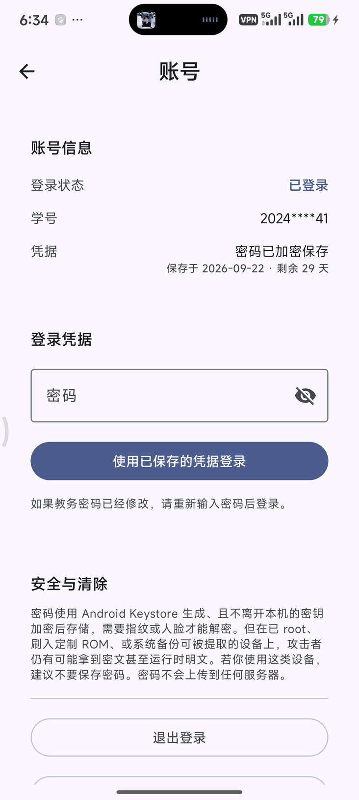

**关于密码，你需要知道：**

- ✅ 密码用 **Android 系统级密钥库（Keystore）** 加密后存在**你的手机里**，  
  密钥本身**不离开手机**，需要指纹或人脸才能解密；
- ✅ **密码绝对不会上传到任何服务器**，我也没有任何服务器可以收；
- ⚠️ 但如果你**已经 root、刷了定制 ROM、或手机备份可以被提取**，  
  攻击者仍有可能拿到密文甚至运行时明文 —— 这种设备上**建议不要保存密码**；
- ✅ 如果手机**没录指纹 / 只支持弱人脸**，App 会**自动降级**：  
  **只记住学号，密码每次手动输**，绝不会为了"能用"就把密码明文存下来；
- ✅ 想彻底清掉：账号页底部 **【清除已保存的凭据】**，一键删除（会二次确认）。

> 页面上「登录状态」显示**已登录**才说明会话可用。  
> 显示**未登录**也没关系 —— 你随时可以点【使用已保存的凭据登录】再进去。
>
> 上图就是**未登录**的样子：学号已经记住了（脱敏显示成 `2024****41`），  
> 只需要点一下按钮、按个指纹就回到已登录状态。

### 第 2 步：同步数据

**底部【校园】→【教务同步】**

**还没设置凭据时**，页面会直接告诉你该去哪（不会让你对着灰按钮猜）：

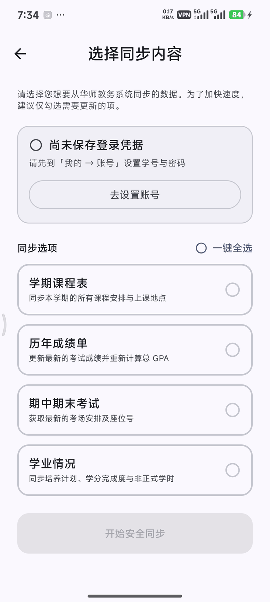

设好账号后回到这里，上方卡片会变成 **「凭据已就绪 · 2024\*\*\*\*41」**：

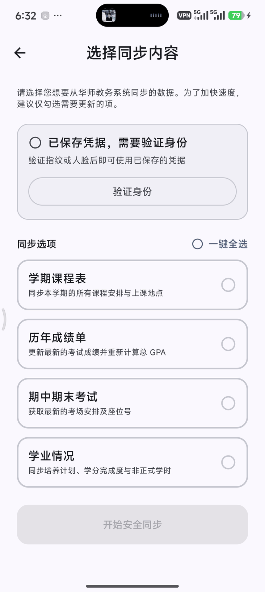

1. 如果显示「需要验证身份」，点一下【验证身份】按指纹；
2. 勾选要同步的内容（点右上角 **【一键全选】** 最省事）：
   - **学期课程表** —— 本学期的课程安排与上课地点
   - **历年成绩单** —— 考试成绩并重算总 GPA
   - **期中期末考试** —— 考场安排与座位号
   - **学业情况** —— 培养计划、学分完成度、非正式学时
3. 点 **【开始安全同步】**，等进度走完。

**同步失败怎么办？**

- **先重试一两次** —— 教务系统偶尔会抽风，这是常态；
- 还不行就**换网络**（比如从校园网切到流量）再试；
- 仍然不行，到反馈渠道告诉我，并把报错截图发我。

> 💡 **同步是「预览确认」式的**：抓到数据才会写入本地，**不会污染你已有的数据**。  
> 同步失败也不会把你之前的数据抹掉。

**到这里就配置完了，可以正常用了。**

---

## 四、课表

### 周课表

打开 App 默认就是课表页。

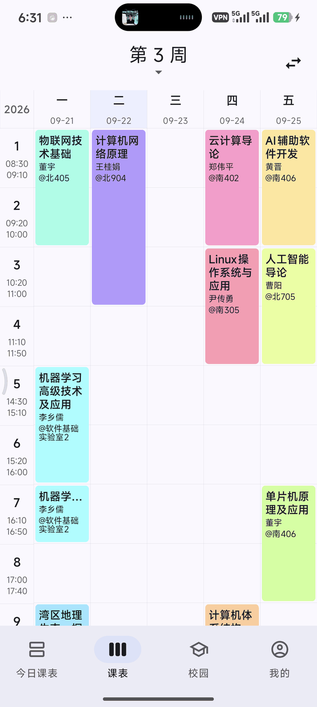

- 顶部 **「第 N 周」** 可以点开快速跳到某一周；
- 右上角的箭头图标是**回到本周**；
- 课程块上直接显示课程名、老师、教室。

### 今日课表

底部 **【今日课表】** —— 只看今天，还会显示**下一节课**和倒计时。

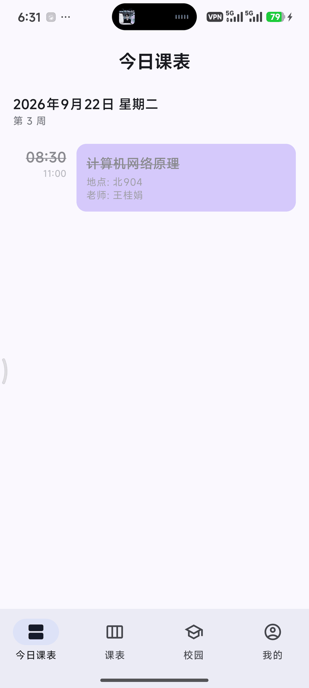

### 课程管理（手动增删改）

**【我的】→【高级功能】→【课程管理】**

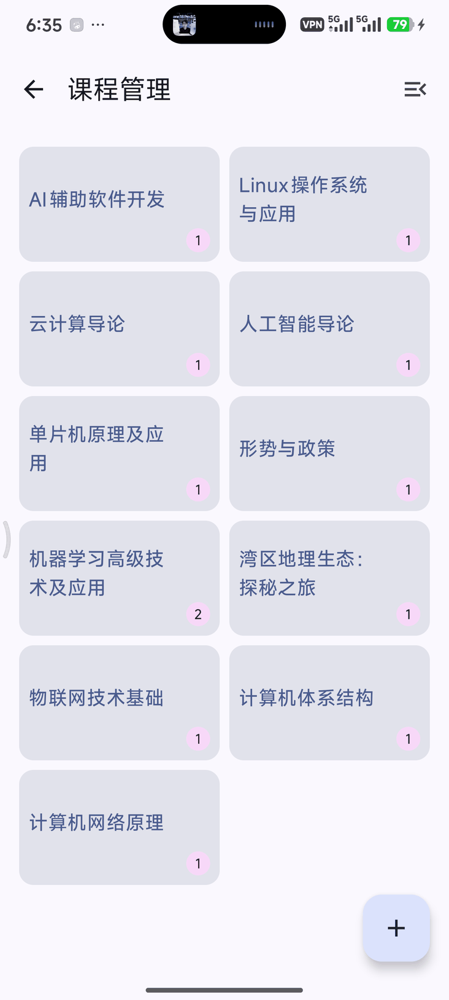

按课程名分组，点进去可以编辑上课时间、地点、老师、周次、单双周等。  
不想用教务同步的同学，可以完全手动录入。

### 课表长什么样，你说了算

**【我的】→【高级功能】→【个性化配置】**

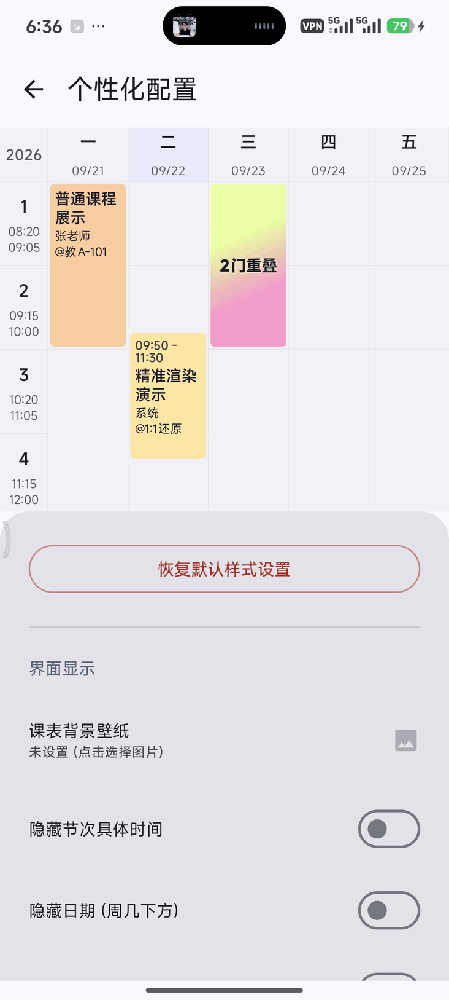

- 课表背景壁纸（可以放自己的图）
- 隐藏节次具体时间 / 隐藏日期 / 隐藏网格线
- 格子高度、圆角、间距、透明度
- 页面顶部有**实时预览**，调完点【恢复默认样式设置】可以一键还原

### 多套课表

**【我的】→【高级功能】→【管理课表】**

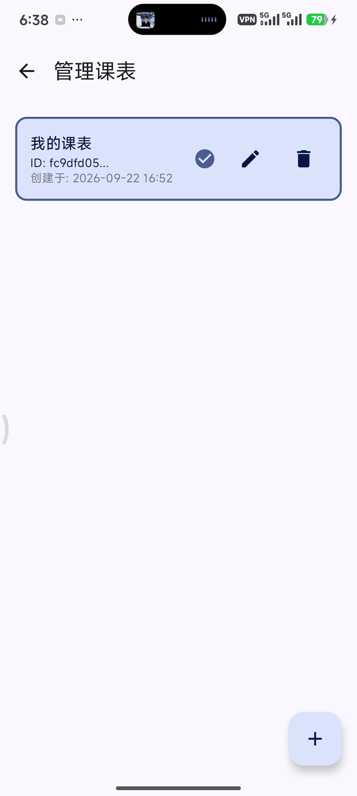

可以建多份课表（比如本专业 + 辅修），随时切换、删除。

### 上课时间不对？

**【我的】→【高级功能】→【自定义时间段】**

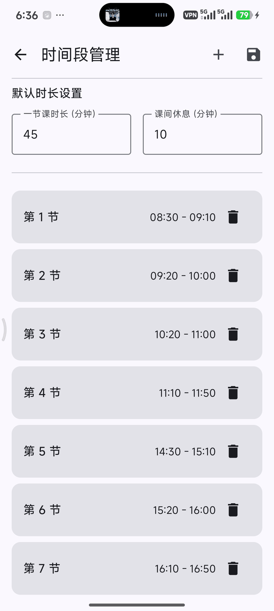

改每节课的开始时间、单节时长、课间休息。**改完课表和提醒都会跟着变。**

### 临时调课 / 批量删课

**【我的】→【通用设置】→【快捷操作】**

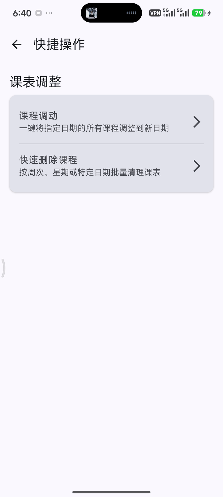

- **课程调动** —— 把某一天的所有课整体挪到另一天（调课神器）
- **快速删除课程** —— 按周次 / 星期 / 特定日期批量清理

### 导入导出 / 备份

**【我的】→【高级功能】→【课表导入/导出】**

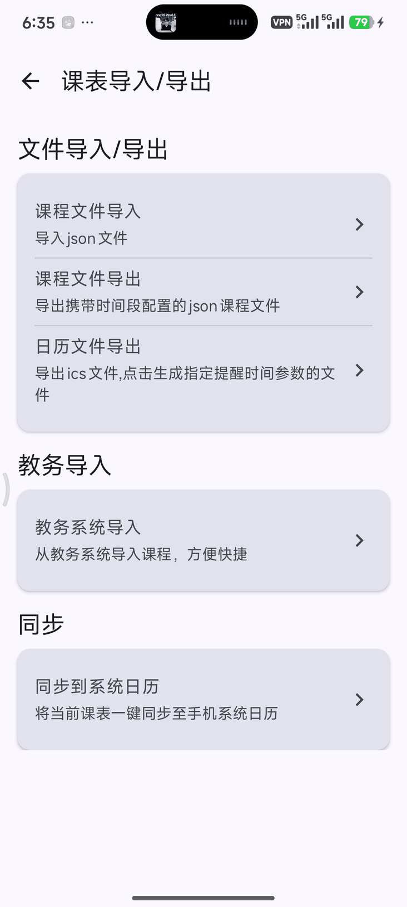

| 选项          | 用途                 |
| ----------- | ------------------ |
| 课程文件导入 / 导出 | JSON 备份，换手机时用这个迁移  |
| 日历文件导出      | 导出 `.ics`，可以导进系统日历 |
| 教务导入        | 从教务系统导入课程          |
| 同步到系统日历     | 一键把当前课表塞进手机日历      |

### 上课提醒

**【我的】→【高级功能】→【课程提醒设置】**

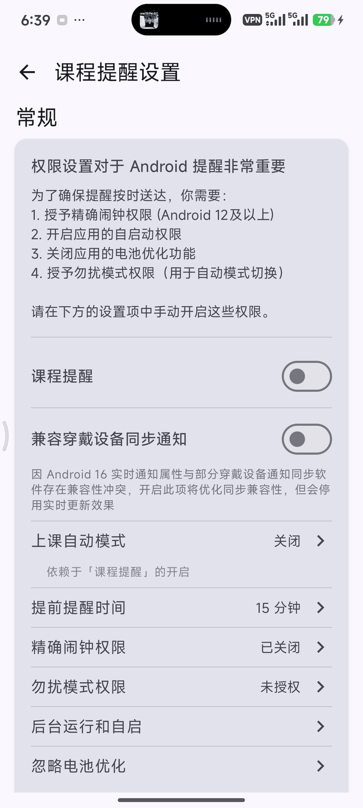

这里能设提前提醒时间（默认 15 分钟）、**上课自动开勿扰模式**等。

> ⚠️ **页面顶部的「权限设置」请一定看完**。安卓对提醒的限制很严，  
> 需要开：**精确闹钟权限**、**自启动**、**关闭电池优化**、**勿扰模式权限**。  
> 不开的话提醒可能不响或者迟到 —— **这不是 App 的 bug，是安卓的限制**。

---

## 五、校园（教务功能）

底部 **【校园】**，是教务相关功能的入口。

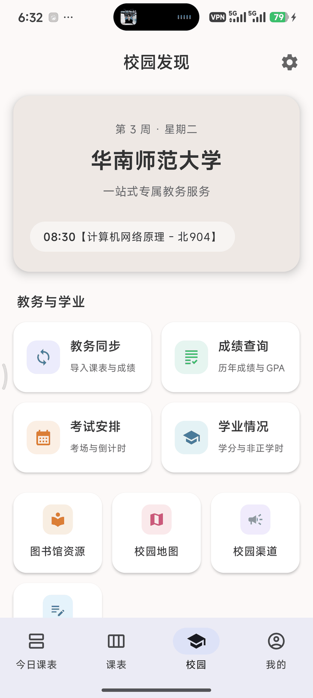

### 教务与学业

| 功能       | 能做什么                          |
| -------- | ----------------------------- |
| **教务同步** | 见 [第一次使用 · 第 2 步](#第-2-步同步数据) |
| **成绩查询** | 历年成绩、平均绩点、按学期分组               |
| **考试安排** | 考场、座位号、倒计时，考完的自动置灰沉底          |
| **学业情况** | 培养计划树 + 学分完成度 + 非正式学时         |

#### 成绩查询

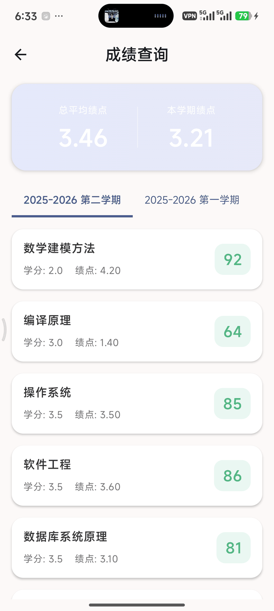

顶部是**总平均绩点**和**本学期绩点**，下面按学期列出每门课的学分、绩点和分数。

#### 考试安排

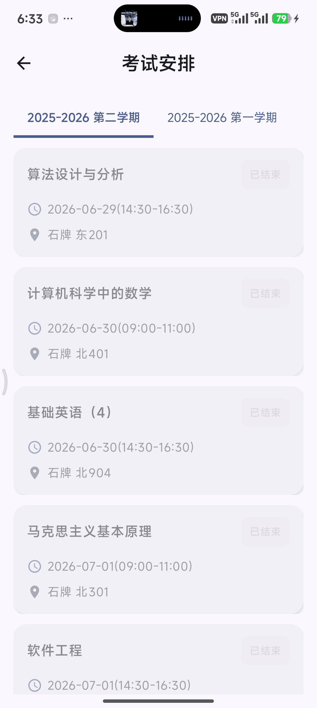

按学期分组，显示考试时间、考场。**已结束的会置灰**，一眼看出还剩几门。

#### 学业情况

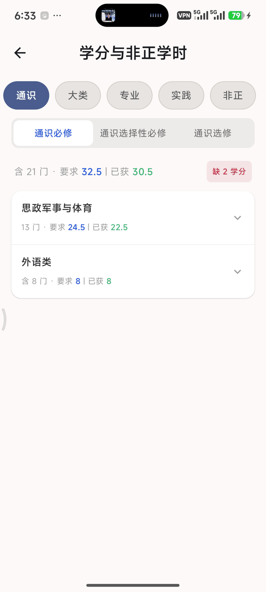

顶部有 **通识 / 大类 / 专业 / 实践 / 非正** 五个标签，可以切换。  
树状展开培养计划，每个模块显示「要求多少学分 / 已获多少 / 还缺多少」。

### 自主选课

校园页下方的 **【选课】**。

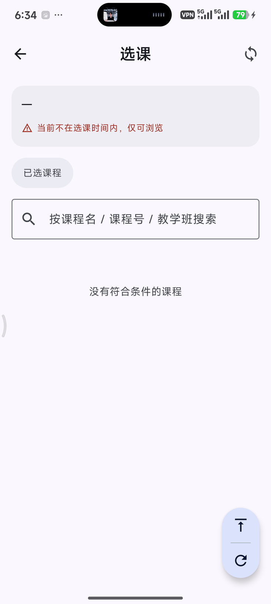

- 顶部会提示**当前是否在选课时间内**（不在时间内只能浏览）；
- 可以按课程名 / 课程号 / 教学班搜索；
- 「已选课程」标签页看已经选上的课；
- 点课程可以看到**各个教学班的余量**，再选具体教学班和子课程。

第一次进入会要一次身份验证：

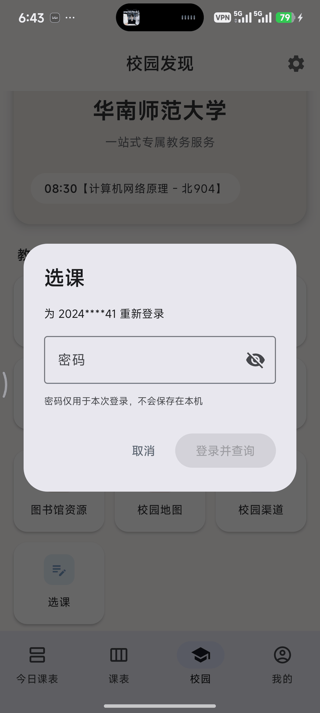

按指纹就行。如果指纹不通过，可以点【取消】后手动输一次密码  
（**这个密码只用于本次登录，不会保存**）。

> ⚠️ **选课结果以教务系统为准**。选课高峰期教务系统很容易超时，  
> App 会尽量帮你确认真实结果，但**选完请回教务系统核对一遍**。

### 其他

往下滑还有 **图书馆资源 / 校园地图 / 校园渠道**，以及最下面的 **选课** 卡片：

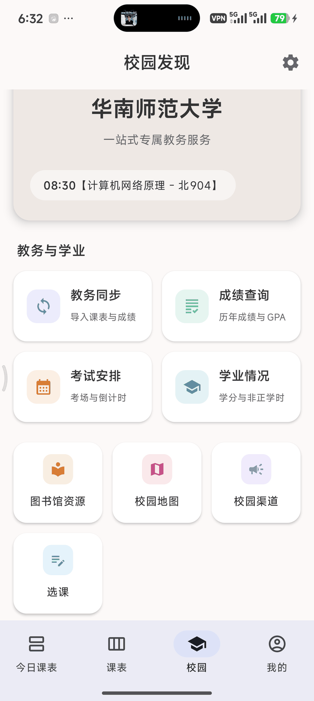

- **图书馆资源** —— 跳转图书馆相关服务
- **校园地图** —— 唤起微信小程序地图，找教学楼、找教室
- **校园渠道** —— 校园发现相关的入口

---

## 六、我的（设置）

底部 **【我的】**。

### 通用设置

| 项目         | 说明                                  |
| ---------- | ----------------------------------- |
| 显示非本周课程    | 打开后能提前看到后面几周的课                      |
| 是否显示周末     | 周末有课才需要开                            |
| **设置开学日期** | ⚠️ 最重要，见 [第 0 步](#第-0-步设置开学日期--别跳过) |
| 本学期总周数     | 默认 20 周                             |
| 当前周数       | 手动调整（自动算错了才用）                       |
| 设置每周起始日    | 周一 / 周日                             |
| 快捷操作       | 课程调动、批量删课                           |

### 高级功能

| 项目      | 说明                |
| ------- | ----------------- |
| **账号**  | 教务登录凭据管理（唯一入口）    |
| 课表导入/导出 | JSON 备份、导出日历、教务导入 |
| 课程提醒设置  | 提醒时间、勿扰、权限检查      |
| 管理课表    | 多套课表切换 / 删除       |
| 课程管理    | 按名称查看和编辑所有课程      |
| 自定义时间段  | 改每节课的上课时间         |
| 个性化配置   | 课表外观（壁纸、圆角、间距…）   |

### 更多

**【我的】→【高级功能】→【更多】**

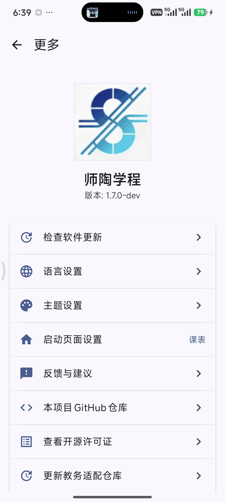

| 项目            | 说明                    |
| ------------- | --------------------- |
| **检查软件更新**    | 有新版本会提示，下载安装即可        |
| 语言设置          | 简体中文 / 繁體中文 / English |
| **主题设置**      | 浅色 / 深色 / 跟随系统 / 动态取色 |
| 启动页面设置        | 决定打开 App 先看到哪一页       |
| **反馈与建议**     | ⭐ 遇到问题来这里告诉我          |
| 本项目 GitHub 仓库 | 看源码、提 Issue           |
| 查看开源许可证       | 开源协议与致谢               |
| 更新教务适配仓库      | 手动拉取最新的教务适配脚本         |

#### 主题设置

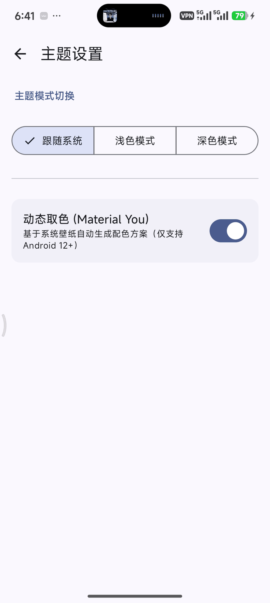

**动态取色（Material You）** 会跟着你的系统壁纸自动生成配色，很好看（需 Android 12+）。

---

## 七、桌面小组件

不用打开 App，在桌面就能看到下一节课 / 今日课程。

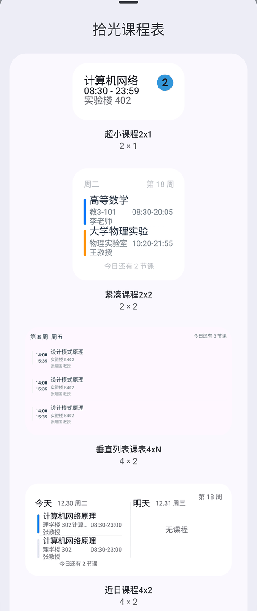

**怎么加**：长按桌面空白处 → 小部件 / 小组件 → 找到「师陶学程」→ 选一个尺寸拖到桌面。

有 4 种尺寸可选：超小（2×1）、紧凑（4×1）、双日（4×2）、列表（4×3）。

> 💡 小组件的数据由 App 在后台更新。如果发现小组件不刷新，  
> 检查一下是不是**被系统省电策略限制了后台运行**（设置里把本 App 的电池优化关掉）。

---

## 八、常见问题

### 🔐 关于账号和隐私

**Q：我的密码会被上传吗？**  
**不会。** 密码用 Android 系统级密钥库加密后**只存在你的手机里**，  
加密密钥本身不离开手机，需要你的指纹或人脸才能解密。  
我没有任何服务器可以接收它 —— 这个 App 连自建后端都没有。

**Q：为什么密码有时候不用输、有时候要输？**  
登录成功后的 **15 分钟内**，进教务功能不用重复验证；  
超过 15 分钟会再要一次指纹。这是为了在"方便"和"安全"之间取平衡 ——  
手机被别人拿到时，不至于直接就进了你的教务系统。

**Q：为什么我的手机不能保存密码？**  
你的手机可能**没录指纹 / 人脸**，或者只支持**弱生物识别**  
（部分机型的人脸属于弱识别，系统不允许用它来加密密钥）。  
这种情况下 App 会**只记住学号**，密码每次手动输 —— 这是刻意的，  
**绝不会为了"能用"就把密码明文存下来**。

**Q：连续输错会怎样？**  
连续失败 **5 次**会进入 **1 分钟冷却**，期间无法再试。  
这是为了防止把你**在学校的统一身份认证账号**试锁掉（它关联邮箱、VPN、图书馆等）。

**Q：换了手机怎么办？**  
到新手机重新安装、重新登录一次即可。**密码不会跟着账号走**（因为根本没上传）。  
课表数据可以用【课表导入/导出】的 JSON 备份迁移。

**Q：卸载 App 数据还在吗？**  
不在。卸载会清掉本地数据（包括保存的凭据）。**重要数据请先导出 JSON 备份。**

### 🔄 关于同步

**Q：同步失败 / 一直转圈？**  
按顺序试：

1. **再点一次**（教务系统本身就不稳定，重试经常就好了）；
2. **换网络**（校园网 ↔ 流量）；
3. 确认**账号密码在教务系统网页上能登录**（密码改过了就得到【我的 → 账号】重新输入）；
4. 还不行 → 反馈给我，带上截图。

**Q：同步会不会把我原来的数据弄丢？**  
不会。同步是**先抓完再写**，只有抓到数据才覆盖；  
而且失败的同步**不会**抹掉你上次成功的数据。

**Q：课表显示的是下个学期的？**  
检查【我的 → 设置开学日期】和【本学期总周数】填对了没有。  
教务同步拉的是**当前学期**，如果开学日期填错，显示就会错位。

**Q：第几周算错了？**  
同样是【设置开学日期】的问题。以教务系统校历上的第一周周一为准。  
实在不确定，用【我的 → 当前周数】手动指定。

### 📊 关于成绩 / 考试 / 学业情况

**Q：成绩是空的？**  
先去【校园 → 教务同步】勾上**「历年成绩单」**同步一次。  
数据是从教务系统抓下来存在本地的，不同步就是空的。

**Q：考试安排不对？**  
同样先同步**「期中期末考试」**。教务系统放出考场信息之前，这里也会是空的。

**Q：学业情况的学分对不上？**  
培养计划以教务系统为准，App 只是把它显示得好看一点。  
如果差异明显，请截图发我，可能是教务系统改了数据结构，我需要适配。

### 🔔 关于提醒

**Q：上课提醒不响？**  
**九成是权限问题**，不是 App 的 bug。到【我的 → 高级功能 → 课程提醒设置】，  
按页面顶部提示逐个开：

1. **精确闹钟权限**（Android 12+）
2. **自启动权限**
3. **关闭电池优化**
4. **勿扰模式权限**（只有用自动模式才需要）

各家手机（小米 / 华为 / OPPO / vivo）的省电策略都很激进，**自启动和电池优化一定要关**。

**Q：节假日还提醒？**  
App 会拉取全年节假日数据，正常应该不会。如果还提醒，反馈给我。

### 📱 关于其他

**Q：App 为什么装不上？**  
大概率是**架构不匹配**。目前只发布了 arm64-v8a 包，  
2018 年以前的老手机可能是 32 位。到反馈渠道告诉我你的机型。

**Q：会一直更新吗？**  
我会尽量跟。但教务系统改接口、学校改规则都可能让某些功能暂时失效，  
**我需要时间适配**，请耐心一点。

---

## 九、反馈与建议

**再强调一次：遇到问题请反馈，不要默默卸载。**

| 渠道            | 位置                                                 |
| ------------- | -------------------------------------------------- |
| ⭐ **App 内反馈** | 我的 → 更多 → **反馈与建议**                                |
| GitHub Issue  | <https://github.com/TangeTiv/SCNU-Schedule/issues> |
| QQ 频道         | `pd87880575`                                       |

**好的反馈长这样：**

> 机型：Redmi K70  
> 版本：v1.7.0  
> 操作：校园 → 教务同步 → 一键全选 → 开始安全同步  
> 期望：同步成功  
> 实际：转圈 30 秒后提示「登录失败: HTTP 500」  
> 附：截图 × 1

**说清楚这几点，我基本能直接定位问题。**

---

## 开源协议与致谢

- 本项目基于 **[拾光课表 (shiguangschedule)](https://github.com/XingHeYuZhuan/shiguangschedule)** 二次开发，  
  衷心感谢原作者 **XingHeYuZhuan（星河欲转）** 提供的开源底座与架构。
- 整体项目遵循 **Apache License 2.0**；原项目版权归 **XingHeYuZhuan** 所有。
- 华师专属功能与教务对接代码由 **TangeTiv** 维护。

  
  Made with ❤️ for SCNU students  

